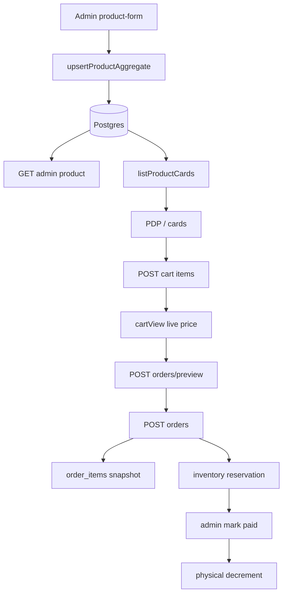

# Auditoría de integridad del flujo de compra — Pastelería Mallorca

**Roles:** Senior Full-Stack · Ecommerce Architect · Backend Architect · Functional QA  
**Fecha:** 2026-09-16  
**Alcance:** Admin Product → DB → API → Storefront → Cart → Checkout → Order → Inventory → Admin Order  
**Distinto de:** [purchase-funnel-audit.md](./purchase-funnel-audit.md) (CRO/UX). Aquí se valida persistencia, contratos y reglas de dominio.

**Políticas adoptadas**

- Pago storefront: **pagar al recoger/entregar**. No hay provider online. El cobro futuro debe usar el total de `createOrder`/`preview`.
- Inventario: `available = physical - reserved`. El carrito no reserva. Pedido unpaid **solo reserva**. Commit (pago admin o cobro en sucursal marcado paid) **decrementa physical**. Cancelación libera una sola vez.

---

## 1. Arquitectura real

```
Admin product-form
  → POST/PATCH /admin/products
  → upsertProductAggregate
  → products / branch_products / product_categories / product_tags / promotions / product_cross_sells
        ↓
GET /products  (catalog.ts listProductCards — precio e inventario COMPUTADOS)
GET /admin/products/:id  (antes: mismo serializer storefront — BUG)
        ↓
POST /cart/session + POST /cart/:id/items  (precio server-side; no reserva)
GET /cart/:id  cartView() reprecia en vivo
        ↓
POST /orders/preview  → createOrder({ previewOnly: true })
POST /orders          → createOrder()  (snapshot + inventario)
POST /orders/:id/payment → 503 stub
        ↓
Admin Pedidos / mark paid / cancel
```

**Fuente de verdad**

| Dominio | Hoy | Archivo |
|---------|-----|---------|
| Catálogo write | `upsertProductAggregate` | `artifacts/api-server/src/lib/product-aggregate.ts` |
| Catálogo read storefront | `listProductCards` / `getProductDetailBySlug` | `catalog.ts` |
| Precio | `resolveCatalogPrice` + `priceOrderLines` | `catalog-promotions.ts`, `order-pricing.ts` |
| Carrito | tablas `carts` / `cart_items`; ID en localStorage | `commerce.ts` |
| Pedido | `createOrder` | `order-create.ts` |
| Inventario vendible | `sellableUnits(physical, reserved)` | `reserved-stock.ts` |
| DB | Drizzle Postgres | `lib/db/src/schema/ecommerce.ts`, `commerce.ts` |

No hay clases `PricingService` / `InventoryService`. Hay helpers puros y **serializers mezclados**.

---

## 2. Data flow



---

## 3. Product Field Matrix

Leyenda: PASS = persiste y round-trip correcto **después de Fase 1**. FAIL = defecto encontrado en diagnóstico.

| Campo | Form key | Payload | API | Service | DB | Admin GET | Storefront |
|-------|----------|---------|-----|---------|-----|-----------|------------|
| id | URL | — | path | insert returning | products.id | PASS | PASS |
| sku | sku | sku | ProductInput | create only | products.sku | PASS | cart sku |
| name | name | name | Input/Update | upsert | products.name | PASS | PC/PD/CT |
| slug | slug | slug | Input; no Update | create only | products.slug | PASS | ruta PDP |
| shortDescription | shortDescription | same | Input/Update | upsert | short_description | PASS | PC |
| description | description | same | Input/Update | upsert | description | PASS | PD |
| status | status | status | Input/Update | upsert | status | PASS | 404 si no active |
| featured | featured | featured | Input/Update | upsert | featured | PASS | home |
| price | price | price | Input/Update | upsert | products.price | PASS | base |
| salePrice | salePrice | salePrice | nullable | upsert | sale_price | PASS | legado |
| categories | categoryIds | categoryIds | arrays | sync replace | product_categories | PASS | filter |
| primary category | primaryCategoryId | same | both | is_primary + category_id | PASS | breadcrumb |
| tags | tagNames | tags[] | Input/Update | sync replace | product_tags + products.tags | PASS | no UI |
| images | imageUrl/gallery | same | Input/Update | upsert | image_url / gallery | PASS | PC/PD/CT |
| branch available | branchConfigurations[].available | same | BranchConfiguration | upsertBranchConfigurations | branch_products.available | **FAIL round-trip** (mezclado con lead time) | gate |
| stock | inventory | inventory | BranchConfiguration | column | branch_products.inventory | **FAIL** (GET devolvía sellable) | sellable |
| reserved | — | — | computed | inventory_reservations | no column | **FAIL** (no expuesto admin) | restado en inventory |
| minStock | minStock | minStock | BranchConfiguration | column | min_stock | PASS | admin |
| criticalStock | criticalStock | enviado | OpenAPI sí | aggregate sí | critical_stock | **FAIL** (Zod route strip) | admin |
| autoAlertEnabled | autoAlertEnabled | enviado | OpenAPI sí | aggregate sí | auto_alert_enabled | **FAIL** (Zod route strip) | admin |
| priceOverride | priceOverride | priceOverride | BranchConfiguration | column | price_override | **FAIL** (form hidrataba price resuelto) | resolved |
| salePriceOverride | no form | import/API | BranchConfiguration | column | sale_price_override | parcial | folded |
| promotion | promotions[] | PromotionInput | create/patch | promotions + promotion_branches | PASS write | computed salePrice |
| lead time | minimumLeadTimeHours | same | Input/Update | products | PASS | PDP |
| seasonal | seasonal | seasonal | Input/Update | products | PASS | badge |
| pickup/delivery product | checkboxes | BranchConfiguration | columns | persistidos | **no gobiernan** selector | P2 |
| cross-sell | crossSellProductIds | max 6 | sync | product_cross_sells | PASS IDs | PDP filtraba en cliente |
| variants | — | — | read only | product_variants | no admin write | PDP/cart |

---

## 4. Price Consistency Matrix

| Superficie | Fuente | Diagnóstico |
|------------|--------|-------------|
| Product DB | products.price / branch price_override | persistido |
| Admin GET | serializer storefront | **FAIL** override vs resuelto |
| PDP | availability.price + salePrice (promo) | cálculo OK |
| Mini-cart | GET /cart cartView | mismo `resolveCatalogPrice` |
| Cart | mismo GET | OK |
| Checkout | POST /orders/preview | `priceOrderLines` — autoridad |
| Payment | no hay provider | N/A; contrato = `priced.total` |
| Order | order_items listUnitPrice / unitPrice / lineTotal | snapshot OK |
| Admin order | serializeOrderItems | muestra lineTotal; faltaba list vs final |

Cliente **no puede** mandar `price=1` (CartItemInput / OrderInput sin precio) — PASS de seguridad.

Cambio de precio con carrito abierto: create reprecia **en silencio** (P1 — informar delta).

---

## 5. Inventory Consistency Matrix (antes de Fase 5)

| Acción | physical | reserved active | sellable mostrado |
|--------|----------|-----------------|-------------------|
| Add/update/remove cart | igual | igual | chequea sellable; no reserva |
| createOrder unpaid | **-qty** | **+qty** | **physical − 2qty** (P0) |
| Admin mark paid | igual | → committed | se “recupera” 1x qty en UI |
| TTL/cancel | **+qty** | released | restaura (sobre el modelo roto) |
| Refund | no existe | — | — |

**Modelo objetivo (Fase 5):** unpaid solo reserva (`consumedPhysical=false`); commit decrementa y marca consumed; release restockea **solo** si `consumedPhysical`.

---

## 6. Cart State Analysis

- Servidor: `carts.branch_id`, `cart_items(product_id, variant_id, quantity, unit_price)`.
- Browser: `localStorage.mallorca_cart_id` + `selected_branch_id`. Fecha/hora **estaban** en sessionStorage (se perdían al cerrar pestaña).
- Add body: `{ productId, variantId?, quantity }` — sin precio.
- Display: `cartView` ignora `unit_price` almacenado y reprecia.
- Mini-cart / Cart / Checkout líneas: mismo GET. Totales checkout: preview server.
- Branch change: preview + nuevo cart + re-add disponibles (no vaciar en silencio).
- Sin reserva de stock en carrito → ventana de oversell hasta create.

---

## 7. Checkout Data Analysis

| Form | State | Payload | DB |
|------|-------|---------|-----|
| name/email/phone | local | customer* | columns |
| notes | notes | notes | customer_notes |
| pickup/delivery | fulfillmentMethod | same | fulfillment_method |
| slot | selectedSlot | scheduledStart | scheduled_start/end |
| calle/número/colonia/CP | 4 inputs | **string concatenado** | **delivery_address text** |
| GPS | lat/lng | deliveryLatitude/Longitude | columns |
| líneas | — | no se envían | desde cart |

Pickup no pide dirección (correcto) pero el payload podía colar address vacía.

Refresh checkout: carrito persistía; slot en sessionStorage se perdía al cerrar pestaña.

---

## 8. Order Snapshot Analysis

`order_items`: productId, variantId, sku, name, variantLabel, quantity, listUnitPrice, unitPrice, lineTotal, promotionId, manualLineItem.

Totales en `orders`: subtotal, promotionDiscountTotal, discountAmount, couponDiscount, deliveryFee, total.

**Falta:** snapshot estructurado de dirección (mismos campos que Sucursales).

---

## 9. Payment Analysis

- `POST /orders/:id/payment` → 503 `PAYMENT_PROVIDER_NOT_CONFIGURED`.
- Storefront crea pedido `pending_payment` / `unpaid`, analytics `purchase` con `pay_on_fulfillment`.
- Confirmación ya copia “Pagas al recogerlo/recibirlo”.
- Doble create: `orders_cart_unique` + cart `converted`.
- No webhook, no refund, no amount a provider.
- TTL storefront ~hasta scheduledEnd; pedido unpaid puede cancelarse solo.

---

## 10. Cache / State Analysis

- React Query: save producto invalida list admin + `getListProductsQueryKey()`.
- SSE `/catalog/events` (`event: catalog-change`) solo lo escuchaba PDP.
- Pub/sub in-process (no multi-instancia).
- Cart GET live-price: no aviso “el precio cambió”.
- Fecha/hora en sessionStorage.

---

## 11. Root causes

1. **Admin GET = serializer de storefront** (`getProductDetailBySlug` → `listProductCards`). Inventario sellable y precio resuelto se reescriben como physical/override.
2. **Zod local `branchConfigurationSchema`** omite `criticalStock` / `autoAlertEnabled`.
3. **createOrder decrementa physical Y crea reserva active** → sellable = physical − 2×qty.
4. **Dirección de delivery** se aplana a un string (mismo patrón que Sucursales).
5. **Pago online no existe**; el pedido sí. Confianza operativa depende de copy + TTL.
6. **Cross-sell filtrado en el cliente** con listado completo.

---

## 12. Severidad

### P0

| ID | Problema |
|----|----------|
| INT-P0-01 | Round-trip Admin: inventory sellable → overwrite physical; priceOverride fabricado |
| INT-P0-02 | Inventario doble-contado en pedidos unpaid |
| INT-P0-03 | Dirección estructurada no persiste |
| INT-P0-04 | No hay cobro online; confirmar como “pagado” sería incorrecto (el stub no debe marcar paid) |

### P1

| ID | Problema |
|----|----------|
| INT-P1-01 | criticalStock / autoAlertEnabled strip |
| INT-P1-02 | DTO Admin vs Storefront compartido |
| INT-P1-03 | Carrito no reserva; oversell entre add y create |
| INT-P1-04 | Cache PLP stale; SSE solo PDP |
| INT-P1-05 | Slot en sessionStorage |
| INT-P1-06 | Reprice silencioso en checkout |
| INT-P1-07 | Cross-sell filter cliente |

### P2

SKU/slug no update, variants sin admin, salePriceOverride sin form, pickup/delivery por producto no gobiernan fulfillment, tags huérfanos, cupones no storefront, export CSV incompleto vs import.

---

## 13. Tests existentes

- `catalog.test.ts` — promo math
- `product-aggregate.test.ts` — tags/categories import helpers
- `promotion-validation.test.ts` / `admin-promotions.test.ts`
- `inventory-status.test.ts` / `inventory.test.ts` — CSV + thresholds
- `order-manual.test.ts` — permisos, delivery fee, slots
- `branch-preview.test.ts` / `branch-flow.test.ts` / `branch-address.test.ts`

**No había** round-trip product Admin→DB→storefront, hold vs commit de inventario, snapshot de dirección, preview vs create totals, concurrencia última unidad.

---

## 14. Tests faltantes (cubiertos en esta corrección)

- Admin GET crudo ≠ storefront computado; re-guardar no muta stock/override
- criticalStock persiste
- Promo 20% solo una sucursal en pricing
- Add-to-cart ignora price extra; qty 0/-1
- Delivery snapshot estructurado
- Hold unpaid no decrementa; commit sí; cancel restock una vez
- Totals 2×350 −20% + delivery
- Import CSV mapea priceOverride/stock/promo/cross-sell al mismo aggregate

---

## 15. Plan de corrección (ejecutado)

| Fase | Qué |
|------|-----|
| 1 | Serializer admin crudo; schema Zod completo; form hidrata override nullable; SSE PLP |
| 2 | Cart view con list/promo; tests qty/price; cross-sell en API |
| 3 | Snapshot dirección; slot en localStorage; revalidación de precio en checkout |
| 4 | Totals tests; no 503 como éxito; amount = priced.total |
| 5 | Hold ≠ decrement; commit/release; alerta sobre available; consumedPhysical |
| 6 | Admin order list vs final + dirección; export CSV con overrides |

Cada finding siguiente usa el formato pedido.

---

## Findings

### INT-P0-01 — Round-trip de producto

**PROBLEMA:** Precio/stock correctos en UI Admin tras GET, incorrectos en DB tras Save sin editar.

**EXPECTED:** `branch_products.inventory` = 10; `price_override` = NULL si no hay override.

**ACTUAL:** inventory podía bajar al sellable; price_override = precio resuelto.

**TRACE:** Admin GET → listProductCards → inventory=sellable, price=override??base → form `priceOverride: availability.price` → PATCH.

**ROOT CAUSE:** Un solo DTO computado para Admin y Storefront.

**FIX:** `getAdminProductDetail` con physical/reserved/available + priceOverride nullable. Form hidrata campos crudos.

**TEST:** `admin-product-serialize.test.ts`, round-trip en `purchase-integrity.test.ts`.

**RESULT:** PASS tras Fase 1.

### INT-P0-02 — Doble conteo de inventario

**PROBLEMA:** Stock 10, compra 2 unpaid → sellable 6.

**EXPECTED:** physical 10, reserved 2, available 8 hasta el pago.

**ACTUAL:** physical 8 + reserved 2.

**ROOT CAUSE:** decrement + reserva active en el mismo create.

**FIX:** `reserveBranchProduct` con `consumedPhysical`; commit decrementa.

**TEST:** `inventory-hold.test.ts`.

**RESULT:** PASS tras Fase 5.

### INT-P0-03 — Dirección

**PROBLEMA:** Checkout captura calle/número/colonia; Order solo `formatted_address`.

**EXPECTED:** snapshot estructurado + string derivado.

**FIX:** `deliveryAddressSnapshot` JSONB + `buildDeliveryAddress`.

**TEST:** `delivery-address.test.ts`.

**RESULT:** PASS tras Fase 3.

### INT-P1-01 — criticalStock strip

**EXPECTED:** form → DB `critical_stock`.

**ACTUAL:** Zod local lo eliminaba.

**FIX:** `branchConfigurationSchema` alineado a OpenAPI.

**RESULT:** PASS tras Fase 1.

### INT-P0-04 — Pago online

**PROBLEMA:** El stub `POST /orders/:id/payment` responde 503; tratarlo como cobro marcaría paid sin dinero.

**EXPECTED:** Storefront crea `pending_payment` / `unpaid`. Copy “pagas al recoger/recibir”. El stub no muta el pedido.

**ACTUAL:** Checkout no llama al stub como éxito; `markPaid: false`, `paymentMethod: PENDING`.

**FIX:** Contrato `amount = priced.total` listo para un provider futuro. No Stripe en este ciclo.

**TEST:** `purchase-integrity.test.ts` (política storefront + 503).

**RESULT:** PASS tras Fase 4.

### INT-P1-02 — DTO Admin vs Storefront

**PROBLEMA:** Un solo `ProductCard` mezclaba persistido y computado.

**FIX:** Admin GET usa `getAdminProductDetail` + `physicalStock` / `reservedStock` / `availableStock` / `priceOverride` nullable. Storefront sigue computado.

**TEST:** `admin-product-serialize.test.ts`.

**RESULT:** PASS tras Fase 1.

### INT-P1-03 — Over-sell entre cart y create

**PROBLEMA:** El carrito no reserva. Dos `createOrder` sobre la última unidad.

**FIX:** Hold unpaid con `SELECT … FOR UPDATE` + `sellable >= qty`. Commit decrementa con `inventory >= qty`.

**TEST:** `inventory-hold.test.ts` sequential holds stock=1.

**RESULT:** PASS (modelo + lock). Integración DB de carrera queda para el entorno con Postgres.

### INT-P1-04 — Cache PLP

**PROBLEMA:** SSE solo en PDP.

**FIX:** `StoreLayout` invalida cualquier query `/api/products*`. Save admin invalida list + slug.

**RESULT:** PASS tras Fase 1.

### INT-P1-05 — Slot sessionStorage

**PROBLEMA:** Cerrar pestaña perdía fecha/hora.

**FIX:** Slot y método también en `localStorage`, igual que sucursal. Checkout persiste la fecha al elegir día.

**RESULT:** PASS tras Fase 3.

### INT-P1-06 — Reprice silencioso

**PROBLEMA:** `createOrder` reprecia sin aviso.

**FIX:** Checkout compara preview vs cart y muestra “el precio de X cambió”. Bloquea confirmación si hay líneas no disponibles.

**RESULT:** PASS tras Fase 3.

### INT-P1-07 — Cross-sell en cliente

**PROBLEMA:** PDP filtraba inactive/OOS/sucursal con el listado completo.

**FIX:** `filterCrossSellCards` en API (`loadFilteredCrossSellProducts`).

**TEST:** `catalog-cross-sell.test.ts`.

**RESULT:** PASS tras Fase 2.

### INT-P2 — Huecos conscientes

SKU/slug no actualizables, variants sin CRUD admin, `salePriceOverride` solo import/API, flags pickup/delivery por producto no gobiernan el selector, tags huérfanos, cupones no storefront. Fuera de este ciclo.

